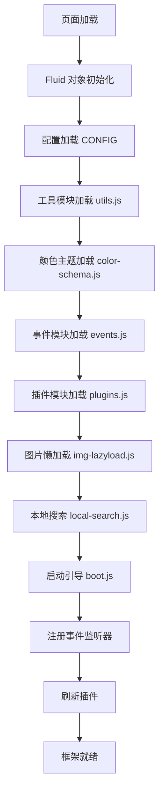
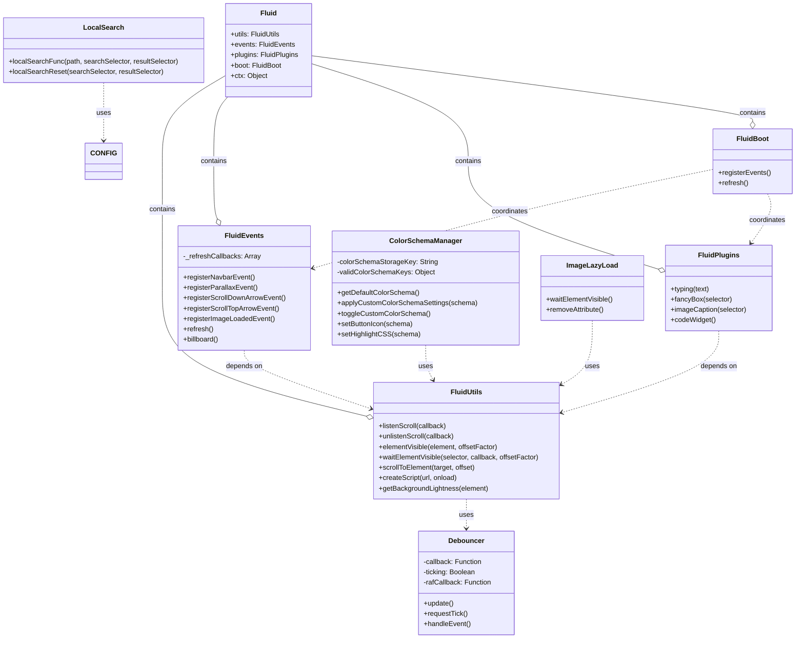

# Fluid Theme Framework 架构分析与设计模式文档

## 概述

Fluid 是一个为 Hexo 静态站点生成器设计的现代化主题框架。该框架采用模块化架构，提供了丰富的交互功能、主题切换、图片懒加载、本地搜索等特性。

## 1. 框架整体架构

### 1.1 架构概览

Fluid 框架采用了**模块化架构**，主要由以下几个核心模块组成：

```
Fluid Framework
├── Fluid (核心命名空间)
│   ├── utils (工具模块)
│   ├── events (事件管理模块)
│   ├── plugins (插件系统模块)
│   └── boot (启动引导模块)
├── Debouncer (性能优化类)
├── ColorSchemaManager (主题切换管理)
├── LocalSearch (本地搜索功能)
└── ImageLazyLoad (图片懒加载)
```

### 1.2 初始化流程



## 2. 核心类和模块详细分析

### 2.1 Fluid 核心命名空间

```javascript
// 全局命名空间定义
var Fluid = window.Fluid || {};
Fluid.ctx = Object.assign({}, Fluid.ctx);
```

**职责**: 作为框架的全局命名空间，管理各个子模块。

### 2.2 Fluid.utils 工具模块

```javascript
Fluid.utils = {
  listenScroll(),        // 滚动监听
  unlistenScroll(),      // 移除滚动监听
  listenDOMLoaded(),     // DOM加载监听
  scrollToElement(),     // 滚动到指定元素
  elementVisible(),      // 元素可见性检测
  waitElementVisible(),  // 等待元素可见
  waitElementLoaded(),   // 等待元素加载
  createScript(),        // 动态创建脚本
  createCssLink(),       // 动态创建样式链接
  loadComments(),        // 加载评论
  getBackgroundLightness(), // 获取背景亮度
  retry()               // 重试机制
}
```

**设计模式**: 
- **工具类模式 (Utility Pattern)**
- **策略模式 (Strategy Pattern)** - 不同的元素监听策略

### 2.3 Debouncer 性能优化类

```javascript
function Debouncer(callback) {
  this.callback = callback;
  this.ticking = false;
}

Debouncer.prototype = {
  constructor: Debouncer,
  update: function() { /* 更新逻辑 */ },
  requestTick: function() { /* 请求动画帧 */ },
  handleEvent: function() { /* 事件处理 */ }
};
```

**设计模式**: 
- **构造函数模式 (Constructor Pattern)**
- **原型模式 (Prototype Pattern)**
- **防抖模式 (Debounce Pattern)**

### 2.4 Fluid.events 事件管理模块

```javascript
Fluid.events = {
  registerNavbarEvent(),      // 导航栏事件
  registerParallaxEvent(),    // 视差滚动事件
  registerScrollDownArrowEvent(), // 下滚箭头事件
  registerScrollTopArrowEvent(),  // 上滚箭头事件
  registerImageLoadedEvent(),     // 图片加载事件
  registerRefreshCallback(),      // 刷新回调注册
  refresh(),                      // 刷新功能
  billboard()                     // 控制台标语
}
```

**设计模式**: 
- **观察者模式 (Observer Pattern)** - 事件监听和回调
- **发布订阅模式 (Pub/Sub Pattern)** - refresh 回调机制

### 2.5 Fluid.plugins 插件系统模块

```javascript
Fluid.plugins = {
  typing(),         // 打字效果
  fancyBox(),       // 图片放大
  imageCaption(),   // 图片标题
  codeWidget()      // 代码组件
}
```

**设计模式**: 
- **插件模式 (Plugin Pattern)**
- **策略模式 (Strategy Pattern)** - 不同的插件策略
- **工厂模式 (Factory Pattern)** - 动态创建DOM元素

### 2.6 Fluid.boot 启动引导模块

```javascript
Fluid.boot = {
  registerEvents: function() {
    // 注册各种事件监听器
  },
  refresh: function() {
    // 刷新插件和事件
  }
}
```

**设计模式**: 
- **外观模式 (Facade Pattern)** - 简化复杂的初始化过程
- **模板方法模式 (Template Method Pattern)** - 标准化的启动流程

## 3. 类与类之间的关系 (UML类图)



## 4. 设计模式详细分析

### 4.1 命名空间模式 (Namespace Pattern)

```javascript
// 避免全局污染，所有功能都在Fluid命名空间下
var Fluid = window.Fluid || {};
Fluid.utils = { /* ... */ };
Fluid.events = { /* ... */ };
Fluid.plugins = { /* ... */ };
```

**优点**: 减少全局变量污染，提供清晰的API结构。

### 4.2 模块模式 (Module Pattern)

```javascript
// 每个功能模块都是独立的对象
Fluid.utils = {
  // 私有方法通过闭包实现
  listenScroll: function(callback) {
    var dbc = new Debouncer(callback);
    // ...
  }
};
```

**优点**: 封装性好，职责分离明确。

### 4.3 观察者模式 (Observer Pattern)

```javascript
// 事件监听和回调机制
Fluid.utils.listenScroll(function() {
  // 滚动时执行的回调
});

// 刷新回调注册
Fluid.events.registerRefreshCallback(function() {
  // 刷新时执行的回调
});
```

**优点**: 低耦合的事件通信机制。

### 4.4 策略模式 (Strategy Pattern)

```javascript
// 不同的元素等待策略
if ('IntersectionObserver' in window) {
  // 使用现代 API
  var io = new IntersectionObserver(/* ... */);
} else {
  // 降级到滚动监听
  var wrapper = Fluid.utils.listenScroll(/* ... */);
}
```

**优点**: 提供多种算法实现，支持优雅降级。

### 4.5 工厂模式 (Factory Pattern)

```javascript
// 动态创建DOM元素
createScript: function(url, onload) {
  var s = document.createElement('script');
  s.setAttribute('src', url);
  // 配置元素属性
  return s;
}
```

**优点**: 统一的对象创建接口。

### 4.6 装饰器模式 (Decorator Pattern)

```javascript
// 扩展原生DOM方法
HTMLElement.prototype.wrap = function(wrapper) {
  this.parentNode.insertBefore(wrapper, this);
  this.parentNode.removeChild(this);
  wrapper.appendChild(this);
};
```

**优点**: 在不修改原有对象的基础上增加新功能。

### 4.7 外观模式 (Facade Pattern)

```javascript
// 简化复杂的初始化过程
Fluid.boot.registerEvents = function() {
  Fluid.events.billboard();
  Fluid.events.registerNavbarEvent();
  Fluid.events.registerParallaxEvent();
  // ... 更多事件注册
};
```

**优点**: 提供简单的接口，隐藏复杂的内部逻辑。

## 5. 框架运行机制

### 5.1 启动流程

1. **配置初始化**: 加载 CONFIG 对象，包含所有主题配置
2. **工具模块加载**: 初始化 Fluid.utils，提供基础工具函数
3. **主题系统加载**: 初始化颜色主题管理系统
4. **核心模块加载**: 依次加载 events、plugins 等核心模块
5. **功能模块加载**: 加载图片懒加载、本地搜索等功能模块
6. **事件注册**: 通过 Fluid.boot.registerEvents() 注册所有事件监听器
7. **插件刷新**: 通过 Fluid.boot.refresh() 激活所有插件

### 5.2 事件驱动架构

框架采用事件驱动架构，主要事件包括：

- **滚动事件**: 导航栏状态、视差效果、返回顶部按钮
- **DOM事件**: 元素加载、可见性检测
- **用户交互事件**: 主题切换、搜索、图片点击
- **生命周期事件**: 页面加载、刷新

### 5.3 性能优化策略

1. **防抖优化**: 使用 Debouncer 类优化滚动事件处理
2. **懒加载**: 图片懒加载减少初始加载时间
3. **渐进增强**: 支持现代API时使用高性能方案，否则优雅降级
4. **按需加载**: 评论、搜索等功能按需初始化

## 6. 扩展性设计

### 6.1 插件系统

框架提供了标准的插件接口：

```javascript
// 添加新插件
Fluid.plugins.newPlugin = function(options) {
  // 插件实现逻辑
};

// 注册刷新回调
Fluid.events.registerRefreshCallback(function() {
  Fluid.plugins.newPlugin();
});
```

### 6.2 配置驱动

通过 CONFIG 对象可以灵活配置各种功能：

```javascript
var CONFIG = {
  "typing": {"enable": true, "typeSpeed": 70},
  "lazyload": {"enable": true, "offset_factor": 2},
  "image_zoom": {"enable": true},
  // ... 更多配置项
};
```

## 7. 总结

Fluid 框架是一个设计优良的主题框架，具有以下特点：

### 优点
1. **模块化架构**: 清晰的职责分离，易于维护和扩展
2. **设计模式丰富**: 运用了多种设计模式，代码结构良好
3. **性能优化**: 多种性能优化策略，用户体验佳
4. **兼容性好**: 支持优雅降级，兼容不同浏览器
5. **可配置性强**: 通过配置对象灵活控制功能
6. **扩展性好**: 插件系统支持功能扩展

### 架构亮点
1. **事件驱动**: 低耦合的事件通信机制
2. **渐进增强**: 现代API优先，传统方案兜底
3. **防抖优化**: 有效提升滚动等高频事件的性能
4. **命名空间**: 避免全局污染，API清晰

该框架展示了现代前端开发的最佳实践，是一个值得学习和借鉴的优秀案例。

## 8. 实际使用示例

### 8.1 如何添加自定义插件

```javascript
// 创建自定义插件
Fluid.plugins.customTooltip = function(selector) {
  if (!selector) return;
  
  jQuery(selector).each(function() {
    var $element = jQuery(this);
    var tooltipText = $element.attr('data-tooltip');
    
    if (tooltipText) {
      $element.on('mouseenter', function() {
        // 显示提示框逻辑
        var tooltip = jQuery('<div class="custom-tooltip"></div>');
        tooltip.text(tooltipText);
        jQuery('body').append(tooltip);
      });
      
      $element.on('mouseleave', function() {
        jQuery('.custom-tooltip').remove();
      });
    }
  });
};

// 注册到刷新回调中
Fluid.events.registerRefreshCallback(function() {
  Fluid.plugins.customTooltip('[data-tooltip]');
});
```

### 8.2 如何扩展工具函数

```javascript
// 扩展 Fluid.utils
Fluid.utils.smoothScrollTo = function(target, duration) {
  duration = duration || 800;
  var targetElement = jQuery(target);
  
  if (targetElement.length) {
    jQuery('html, body').animate({
      scrollTop: targetElement.offset().top
    }, duration);
  }
};

// 使用扩展的工具函数
jQuery('#smooth-scroll-btn').on('click', function() {
  Fluid.utils.smoothScrollTo('#target-section', 1000);
});
```

### 8.3 自定义事件监听器

```javascript
// 添加自定义事件处理
Fluid.events.registerCustomEvent = function() {
  // 监听窗口大小变化
  var resizeHandler = new Debouncer(function() {
    // 响应式布局调整
    console.log('Window resized:', window.innerWidth);
  });
  
  window.addEventListener('resize', resizeHandler);
  
  // 监听滚动方向
  var lastScrollTop = 0;
  Fluid.utils.listenScroll(function() {
    var st = window.pageYOffset || document.documentElement.scrollTop;
    var direction = st > lastScrollTop ? 'down' : 'up';
    
    // 根据滚动方向执行相应逻辑
    if (direction === 'down') {
      jQuery('#navbar').addClass('scroll-down');
    } else {
      jQuery('#navbar').removeClass('scroll-down');
    }
    
    lastScrollTop = st;
  });
};

// 在启动时注册自定义事件
document.addEventListener('DOMContentLoaded', function() {
  Fluid.events.registerCustomEvent();
});
```

### 8.4 配置系统使用示例

```javascript
// 读取配置
var typingEnabled = CONFIG.typing && CONFIG.typing.enable;
var lazyloadOffset = CONFIG.lazyload ? CONFIG.lazyload.offset_factor : 2;

// 根据配置执行不同逻辑
if (typingEnabled) {
  Fluid.plugins.typing(document.getElementById('subtitle').textContent);
}

// 动态修改配置
CONFIG.image_zoom.enable = false; // 禁用图片缩放
Fluid.plugins.fancyBox(); // 重新初始化（不会启用）
```

## 9. 开发最佳实践

### 9.1 插件开发指南

1. **遵循命名约定**: 使用 `Fluid.plugins.pluginName` 格式
2. **支持选择器参数**: 允许指定作用范围
3. **检查依赖**: 确保必要的库已加载
4. **注册刷新回调**: 确保页面刷新时插件重新初始化
5. **性能考虑**: 对于频繁执行的操作使用防抖

```javascript
// 标准插件模板
Fluid.plugins.examplePlugin = function(selector, options) {
  // 1. 参数检查
  if (!selector) return;
  
  // 2. 默认配置
  var defaults = {
    animation: true,
    duration: 300
  };
  var settings = jQuery.extend({}, defaults, options);
  
  // 3. 功能实现
  jQuery(selector).each(function() {
    var $element = jQuery(this);
    // 插件逻辑
  });
  
  // 4. 返回链式调用支持
  return this;
};
```

### 9.2 事件处理最佳实践

```javascript
// 使用防抖优化高频事件
var scrollHandler = new Debouncer(function() {
  // 滚动处理逻辑
});
window.addEventListener('scroll', scrollHandler);

// 使用 Fluid.utils 的标准方法
Fluid.utils.waitElementVisible('#lazy-content', function() {
  // 元素可见时的处理逻辑
}, CONFIG.lazyload.offset_factor);
```

### 9.3 主题扩展建议

1. **保持兼容性**: 确保扩展不破坏现有功能
2. **配置驱动**: 通过 CONFIG 对象控制功能开关
3. **优雅降级**: 为不支持的环境提供替代方案
4. **性能优先**: 避免不必要的DOM操作和事件监听
5. **测试充分**: 在不同浏览器和设备上测试功能

## 10. 技术栈总结

| 组件 | 技术/库 | 用途 |
|------|---------|------|
| **核心框架** | 原生 JavaScript | 主要逻辑实现 |
| **DOM操作** | jQuery | DOM操作和事件处理 |
| **动画** | CSS3 + JavaScript | 视差滚动、主题切换动画 |
| **图片处理** | Fancybox | 图片放大查看 |
| **打字效果** | Typed.js | 动态文字效果 |
| **进度条** | NProgress | 页面加载进度 |
| **代码高亮** | Highlight.js | 代码语法高亮 |
| **剪贴板** | ClipboardJS | 代码复制功能 |
| **构建工具** | Hexo | 静态网站生成器 |

这个架构分析为理解和扩展 Fluid 主题框架提供了全面的技术指导。